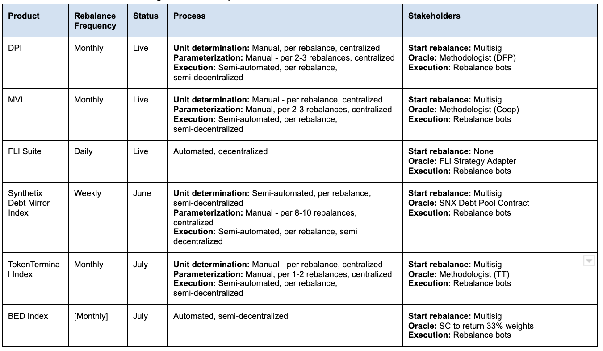

# ITIP-002
*Using template v0.1*
## Abstract
Index Coop and other partners will be seeking to launch numerous portfolio strategies that need to be periodically rebalanced. Currently, these are FLI, DPI and MVI with TTI, BED, SDI, Stable Yield Index in the pipeline.

To successfully handle this load, IC will need to scale, operationalize and automate these rebalances. Historically, IC has spent 2-4 person days every month (Brian, Alex, Dylan) rebalancing 2 existing indices (DPI, MVI). Most hours are spent setting up the rebalances (receiving weights from methodologists, executing multisig transactions, calculating new units, and parameterizing rebalances) which are manual tasks at the moment.

## Motivation
This feature looks to automate the rebalance unit calculation process and helps Index Coop:
1. Further decentralize the rebalance process
2. Streamline rebalances and reduce maintenance hours for IC treasury
3. Prepare to scale and handle 10+ index products
  * Minimize Multisig transactions to start rebalance
  * Horizontally Scalable: handle numerous Sets, various frequencies of rebalances, with different assets / liquidity profiles, across exchanges
  * Minimize rebalance parameterization
  * Minimize methodologist <> Set interactions

This feature will eliminate the need for the multisig to kick off rebalances for index products and improve the UX for methodologists to interact with the system during monthly / weekly rebalances using the GeneralIndexModule ("GIM")

This should work for our existing products (DPI, MVI) and new index products in the pipeline (SMI, BED).

## Background Information
The existing index products utilize the `ICManager` contract and Set Protocol's `GeneralIndexModule`. This is less generalizable / decentralized than the `BaseManager` and `BaseAdapter` system utilized by the FLI suite of products. The introduction of this `IndexRebalanceAdapter` will allow Index Coop to use new system with a `BaseManager`. Additionally, the `FeeSplitAdapter` can be reused to collect streaming fees vs having that functionality in the old `ICManager`

The `FlexibleLeverageStrategyAdapter` uses Chainlink oracles to price slippage and calculate the amount to rebalance. Similarly, we need to use oracles to translate % weights to SetToken units to pass into the GIM `startRebalance` function and price slippage for trades to prevent MEV.

Below is an audit of our current rebalance process for various products:

## Open Questions
- [x] Can we generalize to use any oracle system other than Chainlink?
    - *Yes, using the Set oracles adapter interface*
- [x] Should oracles return the quote in ETH or in USD?
    - *Seems there's more oracles for ETH so we should use ETH. Also ETH is more relevant if we want to route trades through this adapter*
- [ ] Can we get oracles for all assets in our indices?
- [ ] Are there any other admin features we want that will make the Index Coop's lives easier?

## Feasibility Analysis

### Custom index rebalance adapter for each product
This option implements a custom adapter for each index product and encodes the methodology directly in the smart contracts. This is the most decentralized, but also the least flexible option. For DPI, this means encoding the circulation supply calculation and max % weight of 25% in the smart contracts. For SMI, this will directly read the debt pool.

### General rebalance adapter that is standard across indices
This option standardizes methodologist process to only providing % weights. The methodology is still calculated offchain (or in a separate smart contract for onchain data - potentially SMI). The contract will allowlist submitters who are only allowed by the operator to submit % weights depending on the reblanace interval. This is then timelocked based on the methodology. For DPI, this is 7 days. The passed allocation can then be vetoed by the operator during the timelock period. If the period elapses with no veto then anyone can start the rebalance. 

|      | Custom index adapter                                                      | Percent-based rebalance adapter                                                        |
|------|---------------------------------------------------------------------------|----------------------------------------------------------------------------------|
| Pros | Most decentralized, most automated                                        | Can be used across products, standardizes methodologist to operator relationship |
| Cons | Not flexible, need a new adapter for methodology changes and each product | Methodology is calculated offchain so more centralization there 

### Oracle Availability
The two solutions above are reliant on oracles, we need to make sure that we have oracles or a way to access/create oracles for every asset in our indices:    
| Token 	| Index 	| USD Oracle 	| ETH Oracle 	|
|-------	|-------	|------------	|------------	|
| ETH   	| SMI   	| CL         	| N/A        	|
| BTC   	| SMI   	| CL         	| CL         	|
| DPI   	| SMI   	| CL         	| CL         	|
| LINK  	| SMI   	| CL         	| CL         	|
| DAI   	| SMI   	| CL         	| CL         	|
| YFI   	| DPI   	| CL         	| CL         	|
| COMP  	| DPI   	| CL         	| CL         	|
| SNX   	| DPI   	| CL         	| CL         	|
| MKR   	| DPI   	| CL         	| CL         	|
| REN   	| DPI   	| CL         	| CL         	|
| KNC   	| DPI   	| CL         	| CL         	|
| LRC   	| DPI   	| CL         	| CL         	|
| BAL   	| DPI   	|            	| CL         	|
| UNI   	| DPI   	| CL         	| CL         	|
| AAVE  	| DPI   	| CL         	| CL         	|
| MTA   	| DPI   	| CL         	| CL          |
| SUSHI 	| DPI   	| CL         	| CL         	|
| CREAM 	| DPI   	|            	| CL         	|
| FARM  	| DPI   	|            	|             |
| MANA  	| MVI   	|            	| CL         	|
| ENJ   	| MVI   	|            	| CL         	|
| WAXE  	| MVI   	|            	|            	|
| AXS   	| MVI   	|            	|            	|
| SAND  	| MVI   	|            	|            	|
| RFOX  	| MVI   	|            	|            	|
| AUDIO 	| MVI   	|            	|            	|
| DG    	| MVI   	|            	|            	|
| NFTX  	| MVI   	|            	|            	|
| WHALE 	| MVI   	|            	|            	|
| MEME  	| MVI   	|            	|            	|
| TVK   	| MVI   	|            	|            	|
| RARI  	| MVI   	|            	|            	|
| REVV  	| MVI   	|            	|            	|
| MUSE  	| MVI   	|            	|            	|

[Chainlink Oracles](https://docs.chain.link/docs/ethereum-addresses/), Note: All ETH Oracles are 18 decimals, USD oracles are 8 decimals

### Recommendation
Custom adapters that encode the allocation determination algorithm for each index are the ideal scenario from a decentralization perspective and the inevitable end game of these products. However, right now there are not the resources to individually implement each strategy, so we need a solution that ideally can be implemented once and work for all indices. To that end, it makes the most sense to **develop a Percent-based rebalance adapter** where necessary and also develop a **Pass Through Adapter** for indices that don't have an oracle. **Below are the adapters necessary on a index-by-index basis**:    
- **DPI** - We are missing one oracle (FARM) which as of now seems unattainable so to start will use **Pass Through Adapter**. Migrating to this new adapter will still allow for savings by being able to easily integrate with an IndexCoop admin dashboard (vs the status quo).
- **MVI** - Very few oracles exist for these assets, we may need to consider migrating MVI to the new manager system but still just use a **Pass Through Adapter** until sufficient oracles are available. This will require more off-chain work and likely a similar flow to our current set up. Migrating to this new adapter will still allow for savings by being able to easily integrate with an IndexCoop admin dashboard (vs the status quo).
- **SMI** - We have oracles for all of these assets and can easily deploy with a **Percent-based Rebalance Adapter**. With this set up we can make the whole rebalance end-to-end automated, only requiring a review of the new allocations during the timelock period. This could reduce weekly maintenance time potentially to a matter of minutes.
- **BED** - We have oracles for all of these assets and can easily deploy with a **Percent-based Rebalance Adapter** (though may opt to encode the strategy from the start). Since this strategy is easily encodable we can make it end-to-end automated with no requirement for oversight. This could reduce weekly maintenance time potentially to a matter of minutes.

As a final note, in order to reduce code the Pass Through Adapter should be designed to be inheritable by the Percent-based Adapter.

## Timeline
- Spec + review: 3-4 days
- Implementation: 4-5 days
- Internal review: 2 days
- Deployment scripts: 1 day
- Deploy to testnet: 1 day
- Testing: 3-5 days
- Write docs: 1-2 days

## Checkpoint 1
Before more in depth design of the contract flows lets make sure that all the work done to this point has been exhaustive. It should be clear what we're doing, why, and for who. All necessary information on external protocols should be gathered and potential solutions considered. At this point we should be in alignment with product on the non-technical requirements for this feature. It is up to the reviewer to determine whether we move onto the next step.

**Reviewer**:

## Proposed Architecture Changes
A diagram would be helpful here to see where new feature slot into the system. Additionally a brief description of any new contracts is helpful.

## Requirements
These should be a distillation of the previous two sections taking into account the decided upon high-level implementation. Each flow should have high level requirements taking into account the needs of participants in the flow (users, managers, market makers, app devs, etc) 
## User Flows
- Highlight *each* external flow enabled by this feature. It's helpful to use diagrams (add them to the `assets` folder). Examples can be very helpful, make sure to highlight *who* is initiating this flow, *when* and *why*. A reviewer should be able to pick out what requirements are being covered by this flow.
## Checkpoint 2
Before we spec out the contract(s) in depth we want to make sure that we are aligned on all the technical requirements and flows for contract interaction. Again the who, what, when, why should be clearly illuminated for each flow. It is up to the reviewer to determine whether we move onto the next step.

**Reviewer**:

Reviewer: []
## Specification
### [Contract Name]
#### Inheritance
- List inherited contracts
#### Structs
| Type 	| Name 	| Description 	|
|------	|------	|-------------	|
|address|manager|Address of the manager|
|uint256|iterations|Number of times manager has called contract|  
#### Constants
| Type 	| Name 	| Description 	| Value 	|
|------	|------	|-------------	|-------	|
|uint256|ONE    | The number one| 1       	|
#### Public Variables
| Type 	| Name 	| Description 	|
|------	|------	|-------------	|
|uint256|hodlers|Number of holders of this token|
#### Modifiers
> onlyManager(SetToken _setToken)
#### Functions
> issue(SetToken _setToken, uint256 quantity) external
- Pseudo code
## Checkpoint 3
Before we move onto the implementation phase we want to make sure that we are aligned on the spec. All contracts should be specced out, their state and external function signatures should be defined. For more complex contracts, internal function definition is preferred in order to align on proper abstractions. Reviewer should take care to make sure that all stake holders (product, app engineering) have their needs met in this stage.

**Reviewer**:

## Implementation
[Link to implementation PR]()
## Documentation
[Link to Documentation on feature]()
## Deployment
[Link to Deployment script PR]()  
[Link to Deploy outputs PR]()
