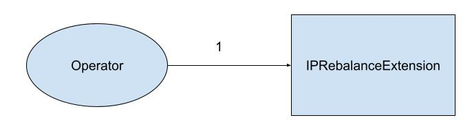
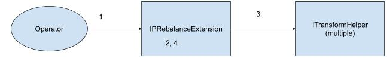
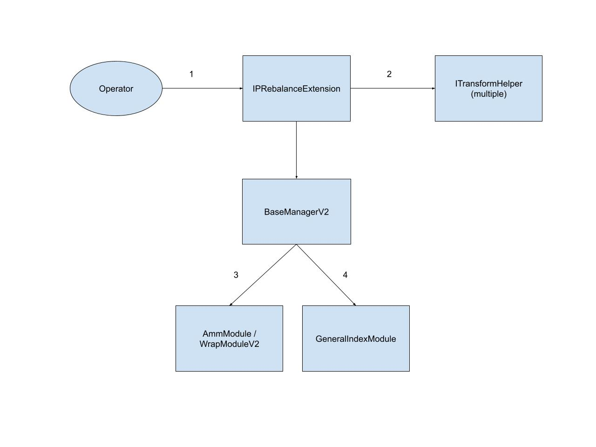
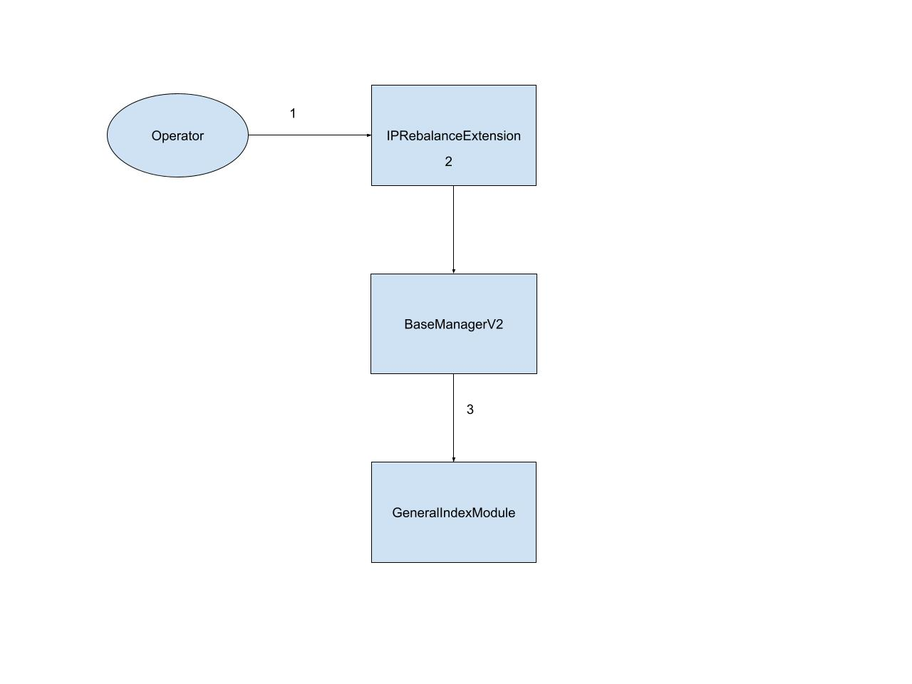
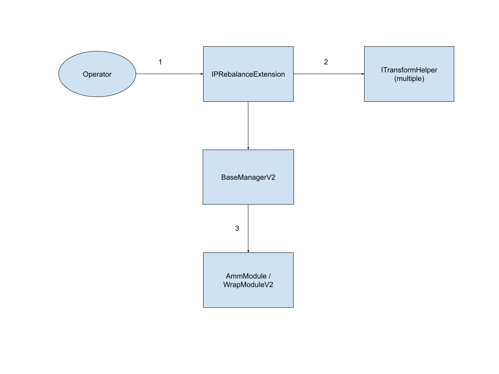

# ITIP-003
*Using template v0.1*
## Abstract
Several upcoming IC products include some form of intrinsic productivity (IP) in their methodologies. IP include yield bearing tokens which take several different forms. While ITIP-002 details how to enable issuance and redemption for these kinds of products, this ITIP will describe the rebalancing process.

## Motivation
In order to deliver products with IP, it must be possible to perform rebalances. Since wrapped tokens generally have poor DEX liquidity, rebalances will require the wrapping and unwrapping of tokens. This requires writing new manager extensions. This feature will be used exclusively by Sets utilizing the `BaseManagerV2` contracts.

## Background Information
For more information on handling issuance and redemption of IP products, refer to https://github.com/SetProtocol/ITIPS/pull/8

IP Rebalance Process:
1. Unwrap all components
2. Perform trades
3. Wrap all components

## Open Questions
- How much structure should the extensions provide for the manager?
- Will wrapping and unwrapping effect arbitrage bots?
- Should we consider interactions with `AmmModule` (needed for PAY)?
- Do we want to allow for partial wrapping/unwrapping (not wrapping/unwrapping full balance)?

## Feasibility Analysis
Intrinsic Productivity Tokens

|Token|Protocol|Module|Adapter|Notes|
|-----|--------|------|-------|-----|
|aTokens|Aave|WrapModuleV2|AaveV2WrapV2Adapter|rebasing|
|cTokens|Compound|WrapModuleV2|CompoundWrapV2Adapter||
|yearn vaults|Yearn|WrapModuleV2|YearnWrapV2Adapter||
|imUSD|mStable|WrapModuleV2|MStableWrapV2Adapter|not built yet|
|curve LP tokens|Curve|AmmModule|CurveAmmAdapter|not built yet, might be able to avoid using the deposit module by zapping in|

Note: tokens with lockups will not be supported

### Option 1: Direct interface for interacting with the `WrapModuleV2`
- Simple to implement
- Requires many multisig transactions to execute rebalances

### Option 2: Direct interface with `WrapModuleV2` with extra batching functions
- Simple to implement
- Only requires one multisig transaction
- If one wrap/unwrap action fails, whole transaction reverts
- Might still need more than one multisig transaction if we run into gas limit issues

### Option 3: Single extension for wrapping/unwrapping and trading (`IPRebalanceExtension`)
- Extra complexity
- Only requires one multisig transaction
- Better abstraction
- Actual wrapping and unwrapping action can be permissionless (similar to how `GeneralIndexModule` works)
- Can generalize wrapped components and AMM deposit components as a general "transformed component" using helper contracts

Since transformed components all have an exchange rate, this system can be built by just specifying the target units of the underlying components. In order to fetch exchange rates, a helper contract of interface`ITransformHelper` can be added to have a `getExchangeRate` function. TransformHelper will also contain methods to inform the extension on how to interact with set protocol to transform/untransform components. To handle cases where both an underlying component can correlate to two different transformed components (such as a set that contains aUSDC and cUSDC), we must also specify the percentage of the target units that will be wrapped.

Below is the outline for executing a rebalance through this process:

1. Ensure the extension knows how to transform and untransform each component
    - This would only need to be done when a new transform component is added. After that it will be saved between rebalances
    - Stores the transform component, underlying component, and transform helper
2. Parametrize the rebalance
    - Pass in the target underlying units as well as the percentage of each underlying unit that should be transformed into each corresponding transform unit
        - If a components target units are being set to 0, store MAX_UINT_256 as the amount to unwrap. This allows us to enforce that 100% of a token is being untransformed in step 3 (which might otherwise not be the case if a token positively rebases between steps 2 and 3).
    - By using the exchange rates, we can calculate the approximate amount of underlying components that the set contains. From there, we can calculate how much of each wrapped component to unwrap. Need to call `AirdropModule` here to handle rebasing tokens.
    - Using simple algebra, we can calculate the target units for the untransformed components, and use that to parametrize the trading portion of the rebalance similar to how the `GIMExtension` works.
    - When transforming components after the trading portion has completed, we use a percentage based system to handle the cases where the final set contains two transform components with the same underlying. In sets where this is not the case, the operator will always provide 100% as the amount to transform.
3. Execute untransform
    - Call `executeUntransform` on `IPRebalanceExtension`
    - Takes in the transformed component to untransform as a parameter
    - Takes in untransformData which can be fetched off-chain by calling getUntransformData on the transform helper for the component
    - Can be marked `onlyAllowedCaller`
4. Execute trades
    - Perform trades through `IPRebalanceExtension`. It will have a similar interface as the `trade` function of `GeneralIndexModule` but will absorb rebase token components before forwarding the trade call to `GeneralIndexModule`
5. Execute transform
    - Call `executeTransform` on `IPRebalanceExtension`
    - Takes in the transformed component as a parameter
    - Takes in transformData which can be fetched off-chain by calling getTransformData on the transform helper for the component
    - Can be marked `onlyAllowedCaller`

Notes:
- Logic for lossy wrapping/unwrapping
    - since rebalancing trades are lossy anyway, not receiving exactly the correct unwrapped units won't cause any major problems
    - since we provide percentages to transform rather than absolute amounts, we do not need to worry about not receiving an exact amount of transformed component units back
    - in the case of tokens that should not be wrapped or unwrapped at certain times, we can add `shouldTransform` and `shouldUntransform` functions to `ITransformHelper` that can prevent the execution of a suboptimal wrap or unwrap.
- Adding and removing components can be handled during steps 1 and 2.
    - Adding a new component
        - Call setTransformData to add the transform data for the component
        - Perform step 2 as normally with the new component and the percentage to wrap in the component list
    - Removing a component
        - Set target units to 0 in step 2

Changes to rebalancing utilities:
- Methodologists will provide percentage based weights.
- Since the contract requires units be given in the underlying components, calculating units should be easy by fetching underlying component prices.
- Additional logic is to handle the cases where the percentage to transform is not 100%
    - Can be handled programmatically
    - Methodologist should specify the underlying units as well as what it is being wrapped into
    - In the case where an underlying unit is being transformed into multiple transform components (or only partially transformed), calculate the correct transform percentage to supply

#### Example 1: Rebalance between wrapped components
|Start Component|Start Weight|End Component|End Weight|
|---------------|------------|-------------|----------|
|aWBTC|50%|aWBTC|30%|
|aDAI|50%|aDAI|70%|

a. Pass in the target underlying units and amounts to be wrapped for each (assume BTC=$50k, DAI=$1, SET=$100)
|Underlying|Underlying Target Units|Percentage Wrapped|
|----------|-----------------------|------------------|
|wBTC|0.3 * 100 / 50000 * 10^8 = 0.0006 * 10^8|100%|
|DAI|0.7 * 100 / 1 * 10^18 = 70 * 10^18|100%|

b. Calculate the amount to unwrap by utilizing the exchange rate from unwrapped to wrapped tokens (aToken exchange rate is 1 to 1)  
- underlying is calculated by: exchangeRate * currentWrappedUnits  
- amount to unwrap is calculated by: max(0, currentUnderlying - targetUnderlying)  

|Wrapped|Underlying|Exchange Rate|Underlying Amount| Amount to Unwrap|
|-------|----------|-------------|-----------------|-----------------|
|aWBTC|wBTC|1|1 * (0.5 * 100 / 50000 * 10^8) = 0.001 * 10^8|max(0, 0.001 - 0.0006) = 0.0004|
|aDAI|DAI|1|1 * (0.5 * 100 / 1 * 10^18) = 50 * 10^18|max(0, 50 - 70) = 0|

c. Calculate target units for the GIM rebalance  
- if it is a wrapped component, target units are always equal to the amount of wrapped units that will remain after unwrap step
- if it is an underlying component, target units are: (1/exchangeRate) * finalUnderlyingUnits - startingUnderlyingUnits  

|Component|Target Units|
|---------|------------|
|wBTC|max(0, (1/1) * 0.0006 - 0.0006) = 0|
|DAI|(1/1) * 70 - 50 = 20|
|aWBTC|0.0006|
|aDAI|50|

d. Calculate amount to rewrap
- since executing the trades can cause slippage, this step should be done after the rebalance via GIM.
- amount to wrap will just be equal to the total underlying amount since percentage for each component is 100%

|Component|Amount to Wrap|
|---------|--------------|
|wBTC|0|
|DAI|20|

#### Example 2: Rebalance with multiple wrapped components with same underlying
|Start Component|Start Weight|End Component|End Weight|
|---------------|------------|-------------|----------|
|aDAI|40%|aDAI|50%|
|cDAI|35%|cDAI|40%|
|aUSDC|25%|aUSDC|10%|

a. Pass in the target underlying units and amounts to be wrapped for each (DAI=$1, USDC=1$, SET=$100)  
- percentage wrapped calculated by: underlyingUnitsInTarget / totalUnderlyingUnitsInTarget

|Underlying|Underlying Target Units|Percentage Wrapped|
|----------|-----------------------|------------------|
|aDAI|0.5 * 100 * 10^18 = 50 * 10^18|50/(50+40) = 55.55%|
|cDAI|0.4 * 100 * 10^18 = 40 * 10^18|40/(50+40) = 44.44%)|
|aUSDC|0.1 * 100 * 10^6 = 10 * 10^6|100%|

b. Calculate the amount to unwrap by utilizing the exchange rate from unwrapped to wrapped tokens (assume aToken and cToken exchange rate is 1 to 1)  
- underlying is calculated by: exchangeRate * currentWrappedUnits  
- amount to unwrap is calculated by: max(0, currentUnderlying - targetUnderlying)  

|Wrapped|Underlying|Exchange Rate|Underlying Amount| Amount to Unwrap|
|-------|----------|-------------|-----------------|-----------------|
|aDAI|DAI|1|40 * 10^18 = 40 * 10^18|max(0, 40 - 50) = 0|
|cDAI|DAI|1|35 * 10^18|max(0, 35-40) =  0|
|aUSDC|USDC|1|25 * 10^6|max(0, 25-10) = 15|

c. Calculate target units for the GIM rebalance  
- if it is a wrapped component, target units are always equal to the amount of wrapped units that will remain after unwrap step
- if it is an underlying component, target units are: max(0, (1/exchangeRate) * finalUnderlyingUnits - startingUnderlyingUnits)
    - if multiple components have the same underlying, underlying units is the combined amount

|Component|Target Units|
|---------|------------|
|DAI|max(0, (1/1) * (50+40) - (40+35)) =  15|
|USDC|max(0, (1/1) * 10-25) = 0|
|aDAI|40|
|cDAI|35|
|aUSDC|10|

d. Calculate amount to rewrap
- since executing the trades can cause slippage, this step should be done after the rebalance via GIM.
- amount to wrap is calculated by: (wrappedPercentage * totalUnderlyingUnitsInSet) - startingUnderlyingUnitsFromWrappedComponent

|Wrapped Component|Amount to Wrap|
|---------|--------------|
|aDAI|0.5555 * 90 - 40 = 9.995|
|cDAI|0.4444 * 90 - 35 = 4.996|

#### Example 3: Rebalance with wrapped component with and underlying
|Start Component|Start Weight|End Component|End Weight|
|---------------|------------|-------------|----------|
|aDAI|40%|aDAI|50%|
|DAI|35%|DAI|40%|
|aUSDC|25%|aUSDC|10%|

a. Pass in the target underlying units and amounts to be wrapped for each (DAI=$1, USDC=1$, SET=$100)  
- percentage wrapped calculated by: underlyingUnitsInTarget / totalUnderlyingUnitsInTarget

|Underlying|Underlying Target Units|Percentage Wrapped|
|----------|-----------------------|------------------|
|aDAI|0.5 * 100 * 10^18 = 50 * 10^18|50/(50+40) = 55.55%|
|DAI|0.4 * 100 * 10^18 = 40 * 10^18|0%|
|aUSDC|0.1 * 100 * 10^6 = 10 * 10^6|100%|

b. Calculate the amount to unwrap by utilizing the exchange rate from unwrapped to wrapped tokens (assume aToken and cToken exchange rate is 1 to 1)  
- underlying is calculated by: exchangeRate * currentWrappedUnits  
- amount to unwrap is calculated by: max(0, currentUnderlying - targetUnderlying)  

|Wrapped|Underlying|Exchange Rate|Underlying Amount| Amount to Unwrap|
|-------|----------|-------------|-----------------|-----------------|
|aDAI|DAI|1|40 * 10^18 = 40 * 10^18|max(0, 40 - 50) = 0|
|none|DAI|1|35 * 10^18|0|
|aUSDC|USDC|1|25 * 10^6|max(0, 25-10) = 15|

c. Calculate target units for the GIM rebalance  
- if it is a wrapped component, target units are always equal to the amount of wrapped units that will remain after unwrap step
- if it is an underlying component, target units are: max(0, (1/exchangeRate) * finalUnderlyingUnits - startingUnderlyingUnits) + startingUnitsFromUnderlyingComponent
    - if multiple components have the same underlying, underlying units is the combined amount
    - startingUnitsFromUnderlyingComponent refers to the initial DAI component units in the Set

|Component|Target Units|
|---------|------------|
|DAI|max(0, (1/1) * (50+40) - (40+35) + 35) =  50|
|USDC|max(0, (1/1) * 10-25) = 0|
|aDAI|40|
|aUSDC|10|

d. Calculate amount to rewrap
- since executing the trades can cause slippage, this step should be done after the rebalance via GIM.
- amount to wrap is calculated by: (wrappedPercentage * totalUnderlyingUnitsInSet) - startingUnderlyingUnitsFromWrappedComponent

|Wrapped Component|Amount to Wrap|
|---------|--------------|
|aDAI|0.5555 * 90 - 40 = 9.995|


## Timeline
TBD

## Checkpoint 1
**Reviewer**:

## Naming Conventions
- Transform Component: A component that has undergone some form of transformation. These are usually wrapped tokens or LP tokens.
- Underlying Component: The token that is the underlying of the transform component.
- Raw Component: A normal token component in the Set (will be present in the final Set Token components without any transformations).
- Set Component: Any component in a Set. Can be either a transform or raw component.

## Proposed Architecture Changes
Managers will rebalance intrinsically productive Sets through a new extension called `IPRebalanceExtension`. `IPRebalanceExtension` will makes calls to helper contracts that adhere to a new `ITransformHelper` interface. This interface will contain functions that inform the extension how properly to interact with Set Protocol to transform and untransform components. This interface will also have functions to get the exchange rate between underlying and transformed components. No changes will be required to the existing manager contracts or to Set Protocol contracts.


## Requirements
- Calculating amounts to transform and untransform is abstracted away from operator.
- Operator only inputs weights denominated in underlying units.
- Actual rebalance weight calculation abstracted away from operator.
- Support Sets with multiple transformed assets with the same underlying component.
- Supports Sets that contain both a transformed asset and its underlying component.
- Support transforming component using either WrapModuleV2 or AmmModule.

## User Flows
### setTransformInfo


1. Operator calls `setTransformInfo` on `IPRebalanceExtension` and pass in the address of the transformed component, underlying component, and transform helper.

### updateTransformInfo


1. Call `updateTransformInfo` on `IPRebalanceExtension` and pass in the address of the transformed component, underlying component, and transform helper.

### startIPRebalance


1. Operator calls `startIPRebalance` and passes in set components, underlying units, and transform percentages.
2. `IPRebalanceExtension` saves the rebalance parameters (set components, target units, and transform percentages) and the units of any raw components thats match up with a transform component's underlying component
3. If it is a transform component, fetch the exchange rate from the applicable `TransformHelper` using the `getExchangeRate` function.
4. Using the targets, calculate the amounts to untransform (if applicable) and save result in untransformUnits.

### executeUntransform


1. Allowed caller calls `executeUntransform` on `IPRebalanceExtension` and passes in the transform component to untransform and the untransformData
    - untransformData can be fetched by calling getUntransformData on the `TransformHelper`
    - call must be done off-chain since this data may encode details such as minOutput amounts
2. `IPRebalanceExtension` fetches calldata for interacting with the `AmmModule` or `WrapModuleV2` by calling `getUntransformCall` on the relevant `TransformHelper`.
3. `IPRebalanceExtension` calls `interactManager` on `BaseManagerV2` and passes the appropriate module and calldata fetched in the prior step to execute the untransform
4. If all transform components that need to be reduced have been untransformed, start a rebalance with the `GeneralIndexModule`. This is done by calculating the appropriate units and calling `interactManager` with the appropriate caller and calldata for starting a rebalance.

### Trade


1. Allowed caller calls `trade` on `IPRebalanceExtension`
2. `IPRebalanceExtension` performs validations
    - Checks that the component passed in is an underlying component rather than a transformed component
    - Checks that tradesComplete flag is false
3. `IPRebalanceExtension` executes trade by calling `trade` on `GeneralIndexModule`.

### setTradesComplete


1. Operator calls `setTradesComplete` on `IPRebalanceExtension`
    - tradesComplete state variable set to true
    - amounts to transform is calculated and saved for each transform component in transformUnits

### executeTransform


1. Allowed caller calls `executeTransform` on `IPRebalanceExtension` and passes in the transform component and the transformData
    - transformData can be fetched by calling getTransformData on the `TransformHelper`
    - call must be done off-chain since this data may encode details such as minOutput amounts
2. `IPRebalanceExtension` fetches calldata for interacting with the `AmmModule` or `WrapModuleV2` by calling `getTransformCall` on the relevant `TransformHelper`.
3. `IPRebalanceExtension` calls `interactManager` on `BaseManagerV2` and passes the appropriate module and calldata fetched in the prior step to execute the transform

## Checkpoint 2
**Reviewer**:

## Specification
### IPRebalanceExtension
#### Inheritance
- GIMExtension
#### Structs
- TransformInfo  

| Type 	| Name 	| Description 	|
|------	|------	|-------------	|
|address|underlyingComponent|address of the underlying component|
|ITransformHelper|transformHelper|Instance of a transform helper|

- RebalanceParams  

| Type 	| Name 	| Description 	|
|------	|------	|-------------	|
|uint256|targetUnderlyingUnits|target rebalance units measured in underlying component amounts|
|uint256|transformPercentages|percentage of total underlying that will be transformed into the component|


#### Public Variables
| Type 	| Name 	| Description 	|
|------	|------	|-------------	|
|IGeneralIndexModule|generalIndexModule|Instance of the GeneralIndexModule|
|mapping(address => TransformInfo)|transformComponentsInfo|Mapping from transformed component address to TransformInfo|
|uint256|untransforms|number of untransform operations left|
|uint256|transforms|number of transform operations left|
|mapping(address => uint256)|untransformUnits|mapping from address of the transform component to the amount to untransform|
|mapping(address => unit256)|transformUnits|mapping from address of the transform component to the amount to transform after rebalance|
|mapping(address => RebalanceParams)|rebalanceParams|mapping from set component to rebalance parameters from startIPRebalance|
|address[]|setComponentList|list of components involved in rebalance|
|mapping(address => uint256|startingUnderlyingComponentUnits|units from raw components that correlate with an underlying component in the set at rebalance start|
|bool|tradesComplete|whether the GIM trades are complete|

#### Functions
Note: functions that appear in `GIMExtension` that will be replicated in `IPRebalanceExtension` will not be described below

> setTransformInfo(address _transformedComponent, TransformInfo _transformInfo) external 
```solidity
function setTransformInfo(address _transformedComponent, TransformInfo _transformInfo) external onlyOperator {
    require(transformComponentsInfo[_transformedComponent].underlyingComponent == address(0), "TransformInfo already set");
    transformComponentsInfo[_transformedComponent] = _transformInfo;
}
```

> updateTransformInfo(address _transformedComponent, TransformInfo _transformInfo) external 
```solidity
function updateTransformInfo(address _transformedComponent, TransformInfo _transformInfo) external onlyOperator {
    require(transformComponentsInfo[_transformedComponent].underlyingComponent != address(0), "TransformInfo not set yet");
    transformComponentsInfo[_transformedComponent] = _transformInfo;
}
```

> startRebalanceWithUnits(address[] memory _components uint256[] memory _targetUnitsUnderlying) external
```solidity
function startRebalanceWithUnits(address[] memory _components uint256[] memory _targetUnitsUnderlying) external {
    revert("IPRebalanceExtension: use startIPRebalance instead");
}
```

> startIPRebalance(address[] memory _setComponents, uint256[] memory _targetUnitsUnderlying) external
- _setComponents: components of the Set (can be a wrapped or raw component)
- _targetUnitsUnderlying: target units after rebalance, measured as the equivalent amount its underlying (normal units if it is a raw component)

```solidity
function startIPRebalance(address[] memory _setComponents, uint256[] memory _targetUnitsUnderlying) external onlyOperator {

    require(_setComponents.length == _targetUnitsUnderlying.length, "IPRebalanceExtension: length mismatch");

    for (uint256 i = 0; i < _component.length; i++) {
        if (_isTransformComponent(_setComponents[i])) {

            uint256 currentUnits = _getCurrentUnits(_setComponents[i]);

            // convert target units from underlying to transformed amounts
            TransformInfo transformInfo = transformComponentsInfo[_setComponents[i]];
            uint256 exchangeRate = transformInfo.transformHelper.getExchangeRate(underlyingComponent, _setComponents[i]);
            uint256 targetUnitsInTransformed = _targetUnitsUnderlying[i].mul(exchangeRate);

            uint256 unitsToUntransform = currentUnits > targetUnitsInTransformed[i] ? currentUnits.sub(targetUnitsInTransformed) : 0;

            if (unitsToUntransform > 0) {
                untransforms++;
                untransformUnits[_setComponents[i]] = unitsToUntransform;
            }

            // for each transform's underlying, save the current amount of the underlying present in
            // the set as a normal raw component. This is usually zero unless a set contains both a 
            // transformed and underlying component
            address underlying = transformComponentsInfo[_setComponents[i]].underlying;
            startingUnderlyingComponentUnits[i] = _getComponentUnits(underlying);
        }

        // saves rebalance parameters for later use to start rebalance through GIM when untransforming is complete
        rebalanceParams[_setComponents[i]].targetUnitsUnderlying = _targetUnitsUnderlying[i];

        // saves the percentage of the total underlying units that should be transformed into this component at end of rebalance
        // this value can be calculates by taking _targetUnitsUnderlying and dividing it by the sum of all underlying and raw components units
        // that are the same token as the underlying of this transform component.
        rebalanceParams.transformPercentages = _calculateTransformPercentage(_setComponents[i], _setComponents, _targetUnitsUnderlying);
    }

    setComponentList = _setComponents;
}
```

> executeUntransform(address _transformComponent, bytes _untransformData) external
```solidity
function executeUntransform(address _transformComponent, bytes _untransformData) external onlyAllowedCaller {

    _absorbAirdrop(_transformComponent);

    uint256 unitsToUntransform = untransformUnits[_transformComponent];
    require(unitsToUntransform > 0 && untransforms > 0, "IPRebalanceExtension: nothing to untransform");

    TransformInfo transformInfo = transformComponentsInfo[_transformComponent];

    require(
        transformInfo.transformHelper.shouldUntransform(transformInfo.underlyingComponent, _transformComponent),
        "IPRebalanceExtension: untransform unavailable"
    );

    // untransform component
    (address module, bytes callData) = transformInfo.transformHelper.getUntransformCall(
        setToken,
        transformInfo.underlyingComponent,
        _transformComponent,
        _untransformData,
        unitsToUntransform
    );
    interactManager(module, callData);

    untransformUnits[_transformComponent] = 0;
    untransforms--;

    // if done untransforming begin the rebalance through GIM
    if (untransforms == 0) {
        _startGIMRebalance();
    }
}
```

> setTradesComplete() external
```solidity
function setTradesComplete() external onlyOperator {
    tradesComplete = true;

    for (uint256 i = 0; i < setComponentList.length; i++) {

        if (_isTransformComponent(setComponentList[i])) {

            uint256 currentUnits = _getCurrentUnits(setComponentList[i]);

            // fetches starting underlying from savedUnderlingComponent
            uint256 startingUnderlying = startingUnderlyingComponentUnits[setComponentList[i]];

            // fetches sum of all underlying units in set (including those in currently transformed positions)
            unit256 totalUnderlyingUnits = _getTotalUnderlyingUnitsInSet();

            uint256 unitsToTransform = rebalanceParams[setComponentList[i]].transformPercentages.mul(totalUnderlyingUnits).sub(startingUnderlying);

            if (unitsToTransform > 0) {
                transforms++;
                transformUnits[setComponentList[i]] = unitsToTransform;
            }
        }
    }
}
```

> trade(IERC20 _component, uint256 _ethQuantityLimit) external
``` solidity
function trade(IERC20 _component, uint256 _ethQuantityLimit) external onlyAllowedCaller {
    require(!tradesComplete, "trades complete");
    // validates that we are not trying to trade a component that has not been untransformed yet
    _checkNotTransformedComponent(_component);
    generalIndexModule.trade(setToken, _component, _ethQuantityLimit);
}
```

> executeTransform(address _transformComponent, bytes _transformData) external
```solidity
function executeTransform(address _transformComponent, bytes _transformData) external onlyAllowedCaller {
    require(tradesComplete, "IPRebalance: trades not complete");
    require(transforms > 0, "IPRebalanceExtension: nothing to transform");

    _absorbAirdrop(_transformComponent);

    uint256 unitsToTransform = transformUnits[_transformComponent];
    TransformInfo transformInfo = transformComponentsInfo[_transformComponent];

    require(
        transformInfo.transformHelper.shouldTransform(transformInfo.underlyingComponent, _transformComponent),
        "IPRebalanceExtension: transform unavailable"
    );

    // transform component
    (address module, bytes callData) = transformInfo.transformHelper.getTransformCall(
        setToken,
        transformInfo.underlyingComponent,
        _transformComponent,
        _transformData,
        unitsToTransform
    );
    interactManager(module, callData);

    transformUnits[_transformComponent] = 0;
    transforms--;

    if (transforms == 0) {
        tradesComplete = false;
    }
}
```

> _startGIMRebalance() internal
```solidity
function _startGIMRebalance() internal {
    
    uint256[] memory rebalanceTargets = new uint256[](setComponentList.length);

    for (uint256 i = 0; i < setComponentList.length; i++) {
        if (_isTransformComponent(componentsList[i])) {
            rebalanceTargets[i] = _getCurrentUnits(setComponentList[i]);
        } else {
            TransformInfo transformInfo = transformComponentsInfo[setComponentList[i]];
            uint256 exchangeRate = transformInfo.transformHelper.getExchangeRate(underlyingComponent, componentsList[i]);

            // get the sum underlying units (including those that are locked in transformed components) in the final Set's composition
            uint256 finalUnderlyingUnits = _getFinalUnderlyingUnits(transformInfo.underlying, setComponentList, rebalanceParams[setComponentList[i]]);

            uint256 startingUnderlying = startingUnderlyingComponentUnits[setComponentList[i]];

            uint256 a = PreciseUnitMath.PRECISE_UNIT.preciseDiv(exchangeRate).mul(finalUnderlyingUnits)
            if (a > startingUnderlying) {
                rebalanceTargets[i] = a.sub(startingUnderlying);
            } else {
                rebalanceTargets[i] = 0;
            }
        }
    }

    (
        address[] memory newComponents,
        uint256[] memory newComponentsTargetUnits,
        uint256[] memory oldComponentsTargetUnits
    ) = _sortNewAndOldComponents(components, rebalanceTargets);

    bytes memory callData = abi.encodeWithSelector(
        IGeneralIndexModule.startRebalance.selector,
        setToken,
        _newComponents,
        _newComponentsTargetUnits,
        _oldComponentsTargetUnits,
        _positionMultiplier
    );

    invokeManager(generalIndexModule, callData);
}
```

### ITransformHelper
#### Functions
> getExchangeRate(address _underlyingComponent, address _transformedComponent) external view
- returns the exchange rate for converting 1 unit of _underlyingComponent into _transformedComponent

> getTransformData(address setToken, address _underlyingComponent, address _transformedComponent, uint256 _units) external view returns (bytes transformData)
- returns the _transformData parameter supplied to the `executeTransform` function of `IPRebalanceExtension
- usually this data will encode some sort of slippage info for AmmModule deposits and withdrawals
- should only be called off-chain to avoid sandwich attacks

> getUntransformData(address setToken, address _underlyingComponent, address _transformedComponent, uint256 _units) external view returns (bytes transformData)
- returns the _untransformData parameter supplied to the `executeUntransform` function of `IPRebalanceExtension
- usually this data will encode some sort of slippage info for AmmModule deposits and withdrawals
- should only be called off-chain to avoid sandwich attacks

> getTransformCall(address _underlyingComponent, address _transformedComponent, bytes _transformData, uint256 _units) external view (address module, bytes callData)
- used by `IPRebalanceExtension` to call the required module for transformations and calldata

> getUntransformCall(address _underlyingComponent, address _transformedComponent, bytes _untransformData, uint256 _units) external view (address module, bytes callData)
- used by `IPRebalanceExtension` to call the required module for transformations and calldata

> shouldTransform(address _underlyingComponent, address _transformedComponent) external view
- returns whether it is safe to transform or not
- some protocols give unfavorable exchange rates during certain times

> shouldUntransform(address _underlyingComponent, address _transformedComponent) external view
- returns whether it is safe to transform or not
- some protocols give unfavorable exchange rates during certain times

## Checkpoint 3
**Reviewer**:

## Implementation
[Link to implementation PR]()
## Documentation
[Link to Documentation on feature]()
## Deployment
[Link to Deployment script PR]()  
[Link to Deploy outputs PR]()
