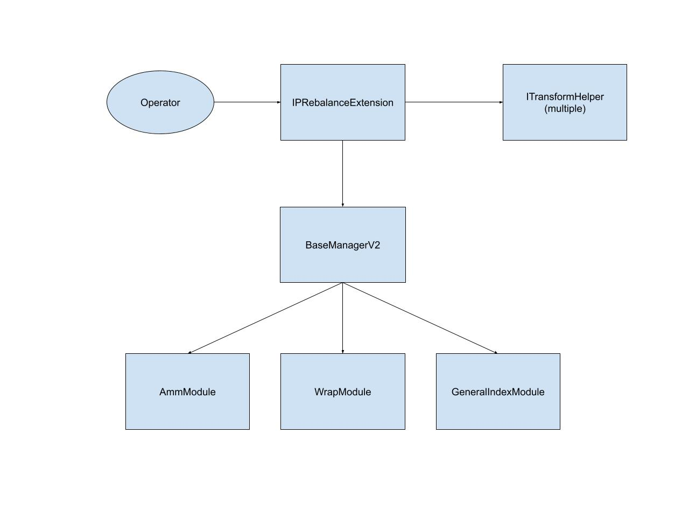

# ITIP-003
*Using template v0.1*
## Abstract
Several upcoming IC products include some form of intrinsic productivity (IP) in their methodologies. IP include yield bearing tokens which take several different forms. While ITIP-002 details how to enable issuance and redemption for these kinds of products, this ITIP will describe the rebalancing process.

## Motivation
In order to deliver products with IP, it must be possible to perform rebalances. Since wrapped tokens generally have poor DEX liquidity, rebalances will require the wrapping and unwrapping of tokens. This requires writing new manager extensions. This feature will be used exclusively by Sets utilizing the `BaseManagerV2` contracts.

## Background Information
For more information on handling issuance and redemption of IP products, refer to https://github.com/SetProtocol/ITIPS/pull/8

IP Rebalance Process:
1. Unwrap all components
2. Perform trades
3. Wrap all components

## Open Questions
- How much structure should the extensions provide for the manager?
- Will wrapping and unwrapping effect arbitrage bots?
- Should we consider interactions with `AmmModule` (needed for PAY)?
- Do we want to allow for partial wrapping/unwrapping (not wrapping/unwrapping full balance)?

## Feasibility Analysis
Intrinsic Productivity Tokens

|Token|Protocol|Module|Adapter|Notes|
|-----|--------|------|-------|-----|
|aTokens|Aave|WrapModuleV2|AaveV2WrapV2Adapter|rebasing|
|cTokens|Compound|WrapModuleV2|CompoundWrapV2Adapter||
|yearn vaults|Yearn|WrapModuleV2|YearnWrapV2Adapter||
|imUSD|mStable|WrapModuleV2|MStableWrapV2Adapter|not built yet|
|curve LP tokens|Curve|AmmModule|CurveAmmAdapter|not built yet, might be able to avoid using the deposit module by zapping in|

Note: tokens with lockups will not be supported

### Option 1: Direct interface for interacting with the `WrapModuleV2`
- Simple to implement
- Requires many multisig transactions to execute rebalances

### Option 2: Direct interface with `WrapModuleV2` with extra batching functions
- Simple to implement
- Only requires one multisig transaction
- If one wrap/unwrap action fails, whole transaction reverts
- Might still need more than one multisig transaction if we run into gas limit issues

### Option 3: Single extension for wrapping/unwrapping and trading (`IPRebalanceExtension`)
- Extra complexity
- Only requires one multisig transaction
- Better abstraction
- Actual wrapping and unwrapping action can be permissionless (similar to how `GeneralIndexModule` works)

Since wrapped components all have an exchange rate, this system can be built by just specifying the target units of the underlying components. In order to fetch exchange rates, a helper contract of interface`IWrapOracle` can be added to have a `getExchangeRate` function. To handle cases where both an underlying component can correlate to two different wrapped components (such as a set that contains aUSDC and cUSDC), we must also specify the percentage of the target units that will be wrapped.

Below is the outline for executing a rebalance through this process:

1. Ensure the extension knows how to wrap and unwrap each component
    - This would only need to be done when a new wrapped component is added. After that it will be saved between rebalances
    - Stores the wrapped component, underlying component, and wrap adapter name
2. Parametrize the rebalance
    - Pass in the target underlying units as well as the percentage of each underlying unit that should be rewrapped into each corresponding wrapped unit
        - If a components target units are being set to 0, store MAX_UINT_256 as the amount to unwrap. This allows us to enforce that 100% of a token is being unwrapped in step 3 (which might otherwise not be the case if a token positively rebases between steps 2 and 3).
    - By using the exchange rates, we can calculate the approximate amount of underlying components that the set contains. From there, we can calculate how much of each wrapped component to unwrap. Need to call `AirdropModule` here to handle rebasing tokens.
    - Using simple algebra, we can calculate the target units for the unwrapped components, and use that to parametrize the trading portion of the rebalance similar to how the `GIMExtension` works.
    - When wrapping components after the trading portion has completed, we use a percentage based system to handle the cases where the final set contains two wrapped components with the same underlying. In sets where this is not the case, the operator will always provide 100% as the amount to wrap.
3. Execute unwrap
    - Call `executeUnwrap` on `IPRebalanceExtension`
    - Goes through the list of components to unwrap calculated in the previous step and unwraps one per call
    - Can be marked `onlyAllowedCaller`
4. Execute trades
    - Call `startRebalance` on `IPRebalanceExtension`
        - does not require any parameters since everything has been parametrized in step 2
    - Perform trades through `GeneralIndexModule` exactly as they are done in a normal simple index rebalance
5. Execute wrap
    - Call `executeWrap` on `IPRebalanceExtension`
    - Goes though the list of components to wrap and calculates the amount to rewrap using the percentages supplied in step 2.
    - Can be marked `onlyAllowedCaller`

Notes:
- Logic for lossy wrapping/unwrapping
    - since rebalancing trades are lossy anyway, not receiving exactly the correct unwrapped units won't cause any major problems
    - since we provide percentages to re-wrap rather than absolute amounts, we do not need to worry about not receiving an exact amount of wrapped units back
    - in the case of tokens that should not be wrapped or unwrapped at certain times, we can add `shouldWrap` and `shouldUnwrap` functions to `IWrapOracle` that can prevent the execution of a suboptimal wrap or unwrap.
- Adding and removing components can be handled during steps 1 and 2.
    - Adding a new component
        - Add the adapter to use in step 1
        - Perform step 2 as normally with the new component and the percentage to wrap in the component list
    - Removing a component
        - Set target units to 0 in step 2

Changes to rebalancing utilities:
- Methodologists will provide percentage based weights.
- Since the contract requires units be given in the underlying components, calculating units should be easy by fetching underlying component prices.
- Additional logic is to handle the cases where the percentage to re-wrap is not 100%
    - Can be handled programmatically
    - Methodologist should specify the underlying units as well as what it is being wrapped into
    - In the case where an underlying unit is being wrapped into multiple wrapped components (or only partially wrapped), calculate the correct re-wrap percentage to supply

#### Example 1: Rebalance between wrapped components
|Start Component|Start Weight|End Component|End Weight|
|---------------|------------|-------------|----------|
|aWBTC|50%|aWBTC|30%|
|aDAI|50%|aDAI|70%|

a. Pass in the target underlying units and amounts to be wrapped for each (assume BTC=$50k, DAI=$1, SET=$100)
|Underlying|Underlying Target Units|Percentage Wrapped|
|----------|-----------------------|------------------|
|wBTC|0.3 * 100 / 50000 * 10^8 = 0.0006 * 10^8|100%|
|DAI|0.7 * 100 / 1 * 10^18 = 70 * 10^18|100%|

b. Calculate the amount to unwrap by utilizing the exchange rate from unwrapped to wrapped tokens (aToken exchange rate is 1 to 1)  
- underlying is calculated by: exchangeRate * currentWrappedUnits  
- amount to unwrap is calculated by: max(0, currentUnderlying - targetUnderlying)  

|Wrapped|Underlying|Exchange Rate|Underlying Amount| Amount to Unwrap|
|-------|----------|-------------|-----------------|-----------------|
|aWBTC|wBTC|1|1 * (0.5 * 100 / 50000 * 10^8) = 0.001 * 10^8|max(0, 0.001 - 0.0006) = 0.0004|
|aDAI|DAI|1|1 * (0.5 * 100 / 1 * 10^18) = 50 * 10^18|max(0, 50 - 70) = 0|

c. Calculate target units for the GIM rebalance  
- if it is a wrapped component, target units are always equal to the amount of wrapped units that will remain after unwrap step
- if it is an underlying component, target units are: (1/exchangeRate) * finalUnderlyingUnits - startingUnderlyingUnits  

|Component|Target Units|
|---------|------------|
|wBTC|max(0, (1/1) * 0.0006 - 0.0006) = 0|
|DAI|(1/1) * 70 - 50 = 20|
|aWBTC|0.0006|
|aDAI|50|

d. Calculate amount to rewrap
- since executing the trades can cause slippage, this step should be done after the rebalance via GIM.
- amount to wrap will just be equal to the total underlying amount since percentage for each component is 100%

|Component|Amount to Wrap|
|---------|--------------|
|wBTC|0|
|DAI|20|

#### Example 2: Rebalance with multiple wrapped components with same underlying
|Start Component|Start Weight|End Component|End Weight|
|---------------|------------|-------------|----------|
|aDAI|40%|aDAI|50%|
|cDAI|35%|cDAI|40%|
|aUSDC|25%|aUSDC|10%|

a. Pass in the target underlying units and amounts to be wrapped for each (DAI=$1, USDC=1$, SET=$100)  
- percentage wrapped calculated by: underlyingUnitsInTarget / totalUnderlyingUnitsInTarget

|Underlying|Underlying Target Units|Percentage Wrapped|
|----------|-----------------------|------------------|
|aDAI|0.5 * 100 * 10^18 = 50 * 10^18|50/(50+40) = 55.55%|
|cDAI|0.4 * 100 * 10^18 = 40 * 10^18|40/(50+40) = 44.44%)|
|aUSDC|0.1 * 100 * 10^6 = 10 * 10^6|100%|

b. Calculate the amount to unwrap by utilizing the exchange rate from unwrapped to wrapped tokens (assume aToken and cToken exchange rate is 1 to 1)  
- underlying is calculated by: exchangeRate * currentWrappedUnits  
- amount to unwrap is calculated by: max(0, currentUnderlying - targetUnderlying)  

|Wrapped|Underlying|Exchange Rate|Underlying Amount| Amount to Unwrap|
|-------|----------|-------------|-----------------|-----------------|
|aDAI|DAI|1|40 * 10^18 = 40 * 10^18|max(0, 40 - 50) = 0|
|cDAI|DAI|1|35 * 10^18|max(0, 35-40) =  0|
|aUSDC|USDC|1|25 * 10^6|max(0, 25-10) = 15|

c. Calculate target units for the GIM rebalance  
- if it is a wrapped component, target units are always equal to the amount of wrapped units that will remain after unwrap step
- if it is an underlying component, target units are: max(0, (1/exchangeRate) * finalUnderlyingUnits - startingUnderlyingUnits)
    - if multiple components have the same underlying, underlying units is the combined amount

|Component|Target Units|
|---------|------------|
|DAI|max(0, (1/1) * (50+40) - (40+35)) =  15|
|USDC|max(0, (1/1) * 10-25) = 0|
|aDAI|40|
|cDAI|35|
|aUSDC|10|

d. Calculate amount to rewrap
- since executing the trades can cause slippage, this step should be done after the rebalance via GIM.
- amount to wrap is calculated by: (wrappedPercentage * totalUnderlyingUnitsInSet) - startingUnderlyingUnitsFromWrappedComponent

|Wrapped Component|Amount to Wrap|
|---------|--------------|
|aDAI|0.5555 * 90 - 40 = 9.995|
|cDAI|0.4444 * 90 - 35 = 4.996|

#### Example 3: Rebalance with wrapped component with and underlying
|Start Component|Start Weight|End Component|End Weight|
|---------------|------------|-------------|----------|
|aDAI|40%|aDAI|50%|
|DAI|35%|DAI|40%|
|aUSDC|25%|aUSDC|10%|

a. Pass in the target underlying units and amounts to be wrapped for each (DAI=$1, USDC=1$, SET=$100)  
- percentage wrapped calculated by: underlyingUnitsInTarget / totalUnderlyingUnitsInTarget

|Underlying|Underlying Target Units|Percentage Wrapped|
|----------|-----------------------|------------------|
|aDAI|0.5 * 100 * 10^18 = 50 * 10^18|50/(50+40) = 55.55%|
|DAI|0.4 * 100 * 10^18 = 40 * 10^18|0%|
|aUSDC|0.1 * 100 * 10^6 = 10 * 10^6|100%|

b. Calculate the amount to unwrap by utilizing the exchange rate from unwrapped to wrapped tokens (assume aToken and cToken exchange rate is 1 to 1)  
- underlying is calculated by: exchangeRate * currentWrappedUnits  
- amount to unwrap is calculated by: max(0, currentUnderlying - targetUnderlying)  

|Wrapped|Underlying|Exchange Rate|Underlying Amount| Amount to Unwrap|
|-------|----------|-------------|-----------------|-----------------|
|aDAI|DAI|1|40 * 10^18 = 40 * 10^18|max(0, 40 - 50) = 0|
|none|DAI|1|35 * 10^18|0|
|aUSDC|USDC|1|25 * 10^6|max(0, 25-10) = 15|

c. Calculate target units for the GIM rebalance  
- if it is a wrapped component, target units are always equal to the amount of wrapped units that will remain after unwrap step
- if it is an underlying component, target units are: max(0, (1/exchangeRate) * finalUnderlyingUnits - startingUnderlyingUnits) + startingUnitsFromUnderlyingComponent
    - if multiple components have the same underlying, underlying units is the combined amount
    - startingUnitsFromUnderlyingComponent refers to the initial DAI component units in the Set

|Component|Target Units|
|---------|------------|
|DAI|max(0, (1/1) * (50+40) - (40+35) + 35) =  50|
|USDC|max(0, (1/1) * 10-25) = 0|
|aDAI|40|
|aUSDC|10|

d. Calculate amount to rewrap
- since executing the trades can cause slippage, this step should be done after the rebalance via GIM.
- amount to wrap is calculated by: (wrappedPercentage * totalUnderlyingUnitsInSet) - startingUnderlyingUnitsFromWrappedComponent

|Wrapped Component|Amount to Wrap|
|---------|--------------|
|aDAI|0.5555 * 90 - 40 = 9.995|


## Timeline
TBD

## Checkpoint 1
**Reviewer**:

## Proposed Architecture Changes
Managers will rebalance intrinsically productive Sets through a new extension called `IPRebalanceExtension`. `IPRebalanceExtension` will makes calls to oracle contracts that adhere to a new `IWrapOracle` interface. This interface will contain `getExchangeRate`, `shouldWrap` and `shouldUnwrap` view functions which `IPRebalanceExtension` will consume. No changes will be required to the existing manager contracts or to Set Protocol contracts.



## Requirements
- Calculating amounts to wrap and unwrap is abstracted away from operator.
- Which wrap adapter and wrap oracle to use for a particular wrapped component is set only when the component is first added, and does not need to be inputted again.
- Operator only inputs weights denominated in underlying units.
- Actual rebalance weight calculation abstracted away from operator.
- Support Sets with multiple wrapped assets with the same underlying component.
- Supports Sets that contain both a wrapped asset and its underlying component.

## User Flows
### Operator wants to add a new wrapped component
1. Deploy a new contract adhering to the `IWrapOracle` interface for the new component if one does not already exist.
2. Deploy a new contract adhering to the `IWrapV2Adapter` and add it to the integration registry of Set Protocol.
3. Call `setWrapInfo` on `IPRebalanceExtension` and pass in the address of the wrapped component, underlying component, and wrap oracle, and the name of the wrap adapter.

### Operator wants to update a components wrap info
1. Call `setWrapInfo` on `IPRebalanceExtension` and pass in the address of the wrapped component, underlying component, and wrap oracle, and the name of the wrap adapter.

### Operator wants to rebalance
1. Check to ensure all wrapped components in both the pre and post rebalance state have an associated wrap info setting.
2. Set the trade maximums, exchanges, cooldown periods, exchange data, target percentage, trader status, and anyone trade status for the `GeneralIndexModule`
    - the interface for these actions will be identical to the same actions of `GIMExtension`
3. Call `startRebalance` and pass in the components, units (denominated in the underlying component if applicable), and the wrap percentage (if applicable).
4. Call `executeUnwrap` repeatedly until all wrapped component have been unwrapped.
    - Use a helper `unwrapComplete` function to check whether to stop unwrapping
5. On the last `executeUnwrap` call, the `GeneralIndexModule` will automatically be initialized. At this point it is safe to execute a rebalance as normally through the `GeneralIndexModule`
6. Once rebalancing trades are complete call `setTradesComplete` to denote that we are ready to wrap components.
7. Once the rebalancing trades are complete, call `executeWrap` repeatedly until all component have been wrapped
    - Use a helper `wrapComplete` function to check whether to stop wrapping

## Checkpoint 2
**Reviewer**:

## Specification
### IPRebalanceExtension
#### Inheritance
- IBaseExtension
#### Structs
- TransformInfo  

| Type 	| Name 	| Description 	|
|------	|------	|-------------	|
|IERC20|underlyingComponent|Instance of the wrapped component|
|ITransformHelper|transformHelper|Instance of the transform helper|

#### Public Variables
| Type 	| Name 	| Description 	|
|------	|------	|-------------	|
|IGeneralIndexModule|generalIndexModule|Instance of the GeneralIndexModule|
|mapping(address => WrapInfo)|transformComponentsInfo|Mapping from transformed component address to WrapInfo|

#### Functions
Note: functions that appear in `GIMExtension` that will be replicated in `IPRebalanceExtension` will not be described below

> setWrapInfo(address _transformedComponent, TransformInfo _transformInfo) external 
```solidity
function setTransformInfo(address _transformedComponent, TransformInfo _transformInfo) external onlyOperator {
    transformComponentsInfo[_transformedComponent] = _transformInfo;
}
```

> startRebalance(address[] memory _components, uint256[] memory _targetUnitsUnderlying, uint256[] memory _transformPercentages) external
```solidity
function startRebalance(address[] memory _components, uint256[] memory _targetUnitsUnderlying, uint256[] memory _transformPercentages) external onlyOperator {

    require(_components.length == _targetUnitsUnderlying.length, "IPRebalanceExtension: length mismatch");
    require(_components.length == _transformPercentages.length, "IPRebalanceExtension: length mismatch");

    for (uint256 i = 0; i < _component.length; i++) {
        if (_isTransformComponent(_components[i])) {

            uint256 currentUnits = _getCurrentUnits(_components[i]);

            // convert target units from underlying to wrapped amounts
            TransformInfo transformInfo = transformComponentsInfo[_components[i]];
            uint256 exchangeRate = transformInfo.transformHelper.getExchangeRate(underlyingComponent, _components[i]);
            uint256 targetUnitsInTransformed = _targetUnitsUnderlying[i].mul(exchangeRate);

            uint256 unitsToUntransform = currentUnits > targetUnitsInTransformed[i] ? currentUnits.sub(targetUnitsInTransformed) : 0;

            if (unitsToUntransform > 0) {
                untransforms++;
                untransformUnits[_components[i]] = unitsToUntransform;
            }
        }
    }

    // saves rebalance parameters for later use to start rebalance through GIM when untransforming is complete
    _saveRebalanceParams(_components, _targetUnitsUnderlying, _transformPercentages);

    // for each transform's underlying, save the current amount of the underlying in the Set
    // this is usually zero unless a set contains both a transformed and underlying component
    _saveStartingUnderlying(_components);
}
```

> executeUntransform(address _transformComponent, bytes _untransformData) external
```solidity
function executeUntransform(address _transformComponent, bytes _untransformData) external onlyAllowedCaller {

    uint256 unitsToUntransform = untransformUnits[_transformComponent];
    require(unitsToUntransform > 0 && untransforms > 0, "IPRebalanceExtension: nothing to untransform");

    TransformInfo transformInfo = transformComponentsInfo[_transformComponent];

    require(
        transformInfo.transformHelper.shouldUntransform(transformInfo.underlyingComponent, _transformComponent),
        "IPRebalanceExtension: untransform unavailable"
    );

    // untransform component
    (address module, bytes callData) = transformInfo.transformHelper.getUntransformCall(
        setToken,
        transformInfo.underlyingComponent,
        _transformComponent,
        _untransformData,
        unitsToUntransform
    );
    interactManager(module, callData);

    untransforms--;

    // if done untransforming begin the rebalance through GIM
    if (untransforms == 0) {
        _startGIMRebalance();
    }
}
```

> setTradesComplete() external
```solidity
function setTradesComplete() external onlyOperator {
    tradesComplete = true;

    (address memory[] components, targetUnits, transformPercentages) = _getSavedRebalanceParams();
    for (uint256 i = 0; i < components.length; i++) {

        if (_isTransformComponent(component[i])) {

            uint256 currentUnits = _getCurrentUnits(components[i]);

            uint256 startingUnderlying = _getSavedStartingUnderlyingUnits(components[i]);

            // fetches sum of all underlying units in set (including those in currently transformed positions)
            unit256 totalUnderlyingUnits = _getTotalUnderlyingUnitsInSet();

            uint256 unitsToTransform = transformPercentages[i].mul(totalUnderlyingUnits).sub(startingUnderlying);

            if (unitsToTransform > 0) {
                transforms++;
                transformUnits[components[i]] = unitsToTransform;
            }
        }
    }
}
```

> executeTransform(address _transformComponent, bytes _transformData) external
```solidity
function executeTransform(address _transformComponent, bytes _transformData) external onlyAllowedCaller {
    require(tradesComplete, "IPRebalance: trades not complete");
    require(transforms > 0, "IPRebalanceExtension: nothing to transform");

    uint256 unitsToTransform = transformUnits[_transformComponent];
    TransformInfo transformInfo = transformComponentsInfo[_transformComponent];

    require(
        transformInfo.transformHelper.shouldTransform(transformInfo.underlyingComponent, _transformComponent),
        "IPRebalanceExtension: transform unavailable"
    );

    // transform component
    (address module, bytes callData) = transformInfo.transformHelper.getTransformCall(
        setToken,
        transformInfo.underlyingComponent,
        _transformComponent,
        _transformData,
        unitsToTransform
    );
    interactManager(module, callData);

    transforms--;

    if (transforms == 0) {
        tradesComplete = false;
    }
}
```

> _startGIMRebalance() internal
```solidity
function _startGIMRebalance() internal {

    (address memory[] components, targetUnits, transformPercentages) = _getSavedRebalanceParams();
    
    uint256[] memory rebalanceTargets = new uint256[](components.length);

    for (uint256 i = 0; i < components.length; i++) {
        if (_isTransformComponent(components[i])) {
            uint256 units = _getCurrentUnits(components[i]);
            rebalanceTargets[i] = units;
        } else {
            TransformInfo transformInfo = transformComponentsInfo[_components[i]];
            uint256 exchangeRate = transformInfo.transformHelper.getExchangeRate(underlyingComponent, _components[i]);

            // get the sum underlying units (including those that are locked in transformed components) in the final Set's composition
            uint256 finalUnderlyingUnits = _getFinalUnderlyingUnits(transformInfo.underlying, components, targetUnits);

            uint256 startingUnderlying = _getSavedStartingUnderlyingUnits(components[i]);

            uint256 a = PreciseUnitMath.PRECISE_UNIT.preciseDiv(exchangeRate).mul(finalUnderlyingUnits)
            if (a > startingUnderlying) {
                rebalanceTargets[i] = a.sub(startingUnderlying);
            } else {
                rebalanceTargets[i] = 0;
            }
        }
    }

    (
        address[] memory newComponents,
        uint256[] memory newComponentsTargetUnits,
        uint256[] memory oldComponentsTargetUnits
    ) = _sortNewAndOldComponents(components, rebalanceTargets);

    bytes memory callData = abi.encodeWithSelector(
        IGeneralIndexModule.startRebalance.selector,
        setToken,
        _newComponents,
        _newComponentsTargetUnits,
        _oldComponentsTargetUnits,
        _positionMultiplier
    );

    invokeManager(generalIndexModule, callData);
}
```

### ITransformHelper
#### Functions
> getExchangeRate(address _underlyingComponent, address _transformedComponent) external view
- returns the exchange rate for converting 1 unit of _underlyingComponent into _transformedComponent

> getTransformData(address setToken, address _underlyingComponent, address _transformedComponent, uint256 _units) external view returns (bytes transformData)
- returns the _transformData parameter supplied to the `executeTransform` function of `IPRebalanceExtension
- usually this data will encode some sort of slippage info for AmmModule deposits and withdrawals
- should only be called off-chain to avoid sandwich attacks

> getUntransformData(address setToken, address _underlyingComponent, address _transformedComponent, uint256 _units) external view returns (bytes transformData)
- returns the _untransformData parameter supplied to the `executeUntransform` function of `IPRebalanceExtension
- usually this data will encode some sort of slippage info for AmmModule deposits and withdrawals
- should only be called off-chain to avoid sandwich attacks

> getTransformCall(address _underlyingComponent, address _transformedComponent, bytes _transformData, uint256 _units) external view (address module, bytes callData)
- used by `IPRebalanceExtension` to call the required module for transformations and calldata

> getUntransformCall(address _underlyingComponent, address _transformedComponent, bytes _untransformData, uint256 _units) external view (address module, bytes callData)
- used by `IPRebalanceExtension` to call the required module for transformations and calldata

> shouldTransform(address _underlyingComponent, address _transformedComponent) external view
- returns whether it is safe to transform or not
- some protocols give unfavorable exchange rates during certain times

> shouldUntransform(address _underlyingComponent, address _transformedComponent) external view
- returns whether it is safe to transform or not
- some protocols give unfavorable exchange rates during certain times

## Checkpoint 3
**Reviewer**:

## Implementation
[Link to implementation PR]()
## Documentation
[Link to Documentation on feature]()
## Deployment
[Link to Deployment script PR]()  
[Link to Deploy outputs PR]()
